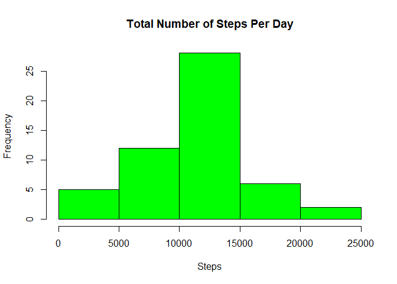
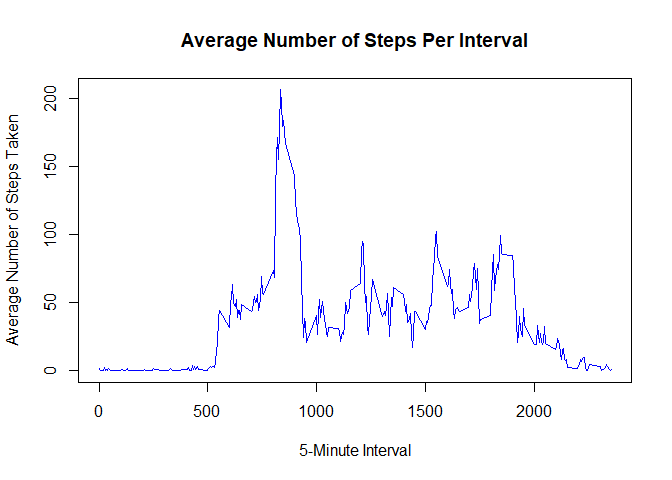
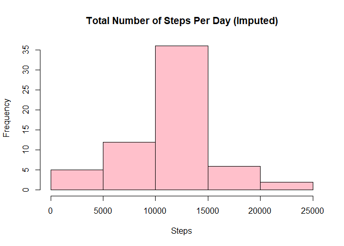
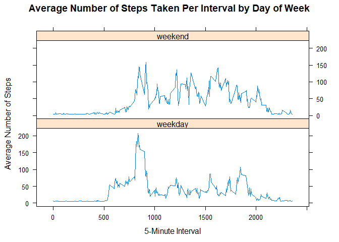

## Loading and preprocessing the data

**1. Load the data (i.e. read.csv()).** (NOTE: The Github repository contains the dataset for the
assignment so you do not have to download the data separately.)


```r
unzip("activity.zip")
activity <- read.csv("activity.csv")
```

**2. Process/transform the data (if necessary) into a format suitable for your
analysis.**

Look at a summary of the data.


```r
summary(activity)
```

```
##      steps                date          interval     
##  Min.   :  0.00   2012-10-01:  288   Min.   :   0.0  
##  1st Qu.:  0.00   2012-10-02:  288   1st Qu.: 588.8  
##  Median :  0.00   2012-10-03:  288   Median :1177.5  
##  Mean   : 37.38   2012-10-04:  288   Mean   :1177.5  
##  3rd Qu.: 12.00   2012-10-05:  288   3rd Qu.:1766.2  
##  Max.   :806.00   2012-10-06:  288   Max.   :2355.0  
##  NA's   :2304     (Other)   :15840
```

## What is mean total number of steps taken per day?

For this part of the assignment, you can ignore the missing values in the
dataset.

**1. Calculate the total number of steps taken per day.**


```r
totalStepsPerDay <- aggregate(steps ~ date, activity, sum)
head(totalStepsPerDay)
```

```
##         date steps
## 1 2012-10-02   126
## 2 2012-10-03 11352
## 3 2012-10-04 12116
## 4 2012-10-05 13294
## 5 2012-10-06 15420
## 6 2012-10-07 11015
```

**2. Make a histogram of the total number of steps taken each day.**


```r
hist(totalStepsPerDay$steps,
     breaks = 5,
     xlab = "Steps",
     main = "Total Number of Steps Per Day",
     col = "green")
```

<!-- -->

**3. Calculate and report the mean and median of the total number of steps taken
per day.**


```r
meanStepsPerDay <- as.integer(mean(totalStepsPerDay$steps))
medianStepsPerDay <- as.integer(median(totalStepsPerDay$steps))
meanStepsPerDay
```

```
## [1] 10766
```

```r
medianStepsPerDay
```

```
## [1] 10765
```

## What is the average daily activity pattern?

**1. Make a time series plot (i.e. type = "l") of the 5-minute interval (x-axis)
and the average number of steps taken, averaged across all days (y-axis).**


```r
stepsPerInterval <- aggregate(steps ~ interval, activity, mean)
head(stepsPerInterval)
```

```
##   interval     steps
## 1        0 1.7169811
## 2        5 0.3396226
## 3       10 0.1320755
## 4       15 0.1509434
## 5       20 0.0754717
## 6       25 2.0943396
```

```r
plot(stepsPerInterval,
     type = "l",
     xlab = "5-Minute Interval",
     ylab = "Average Number of Steps Taken",
     main = "Average Number of Steps Per Interval",
     col = "blue")
```

<!-- -->

**2. Which 5-minute interval, on average across all the days in the dataset,
contains the maximum number of steps?**


```r
maxSteps <- stepsPerInterval$interval[which.max(stepsPerInterval$steps)]
maxSteps
```

```
## [1] 835
```

## Imputing missing values

Note that there are a number of days/intervals where there are missing values
(coded as NA). The presence of missing days may introduce bias into some
calculations or summaries of the data.

**1. Calculate and report the total number of missing values in the dataset
(i.e. the total number of rows with NAs).**


```r
totalMissingValues <- length(which(is.na(activity$steps)))
totalMissingValues
```

```
## [1] 2304
```

**2. Devise a strategy for filling in all of the missing values in the dataset.
The strategy does not need to be sophisticated. For example, you could use
the mean/median for that day or the mean for that 5-minute interval, etc.**

Strategy: Use the **impute()** function from the Hmisc package and the mean for
that day as the strategy for filling in all of the missing values in the
dataset.


```r
install.packages("Hmisc")
```

```
## Installing package into 'C:/Users/cbardsley/Documents/R/win-library/3.3'
## (as 'lib' is unspecified)
```

```
## package 'Hmisc' successfully unpacked and MD5 sums checked
## 
## The downloaded binary packages are in
## 	C:\Users\cbardsley\AppData\Local\Temp\RtmpUPbm6U\downloaded_packages
```

```r
library(Hmisc)
```

```
## Loading required package: survival
```

```
## Loading required package: Formula
```

```
## Loading required package: ggplot2
```

```
## 
## Attaching package: 'Hmisc'
```

```
## The following objects are masked from 'package:base':
## 
##     format.pval, round.POSIXt, trunc.POSIXt, units
```

**3. Create a new dataset that is equal to the original dataset but with the
missing data filled in.**


```r
activityImputed <- activity
activityImputed$steps <- impute(activity$steps, mean)
```

**4. Make a histogram of the total number of steps taken each day and calculate
and report the mean and median total number of steps taken per day. Do these
values differ from the estimates from the first part of the assignment? What is
the impact of imputting missing data on the estimates of the total daily number
of steps?**


```r
totalStepsPerDayImputed <- aggregate(steps ~ date, activityImputed, sum)

head(totalStepsPerDayImputed)
```

```
##         date    steps
## 1 2012-10-01 10766.19
## 2 2012-10-02   126.00
## 3 2012-10-03 11352.00
## 4 2012-10-04 12116.00
## 5 2012-10-05 13294.00
## 6 2012-10-06 15420.00
```

```r
hist(totalStepsPerDayImputed$steps,
     breaks = 5,
     xlab = "Steps",
     main = "Total Number of Steps Per Day (Imputed)",
     col = "pink")
```

<!-- -->

```r
meanStepsPerDayImputed <- as.integer(mean(totalStepsPerDayImputed$steps))
medianStepsPerDayImputed <- as.integer(median(totalStepsPerDayImputed$steps))
meanStepsPerDayImputed
```

```
## [1] 10766
```

```r
medianStepsPerDayImputed
```

```
## [1] 10766
```

Impact of imputting the missing data on the estimates of the total daily number of steps:  

* The value for the mean does NOT differ from the estimate from the first part of the assignment.  
* However, the value for the median from the first part of the assignment was 10765. It is now 10766--the same as the mean.

## Are there differences in activity patterns between weekdays and weekends

For this part the **weekdays()** function may be of some help here. Use the
dataset with the filled-in missing values for this part.

**1. Create a new factor variable in the dataset with two levels - "weekday" and
"weekend" indicating whether a given date is a weekday or weekend day.**


```r
activityImputed$dayOfWeek <- ifelse(as.POSIXlt(activityImputed$date)$wday %in% c(0,6),
                                    "weekend",
                                    "weekday")
```

**2. Make a panel plot containing a time series plot (i.e., type = "l") of the
5-minute interval (x-axis) and the average number of steps taken, averaged
across all weekday days (y-axis).** See the README file in the GitHub repository
to see an example of what this plot should look like using simulated data.


```r
library(lattice)

meanActivityImputed <- aggregate(steps ~ interval + dayOfWeek,
                                data = activityImputed,
                                mean)

xyplot(steps ~ interval | dayOfWeek,
        data = meanActivityImputed,
        type = "l",
        layout = c(1,2),
        xlab = "5-Minute Interval",
        ylab = "Average Number of Steps",
        main = "Average Number of Steps Taken Per Interval by Day of Week")
```

<!-- -->
